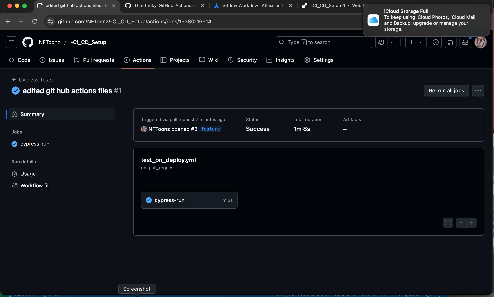
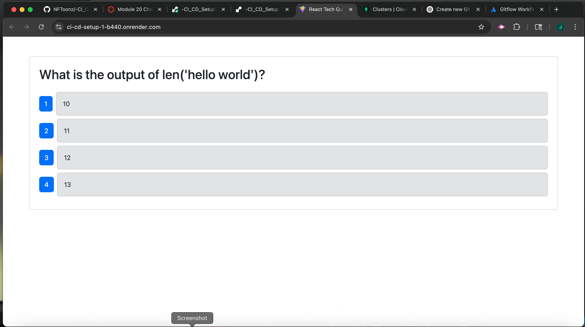

# -CI_CD_Setup
Module 20 Challenge

website Url: https://ci-cd-setup-1-b440.onrender.com 

Summary

This project showcases a CI/CD pipeline built with GitHub Actions to automate the testing and deployment process for a full stack application.

As an entry-level Full Stack Engineer, this project demonstrates hands-on experience with:

Continuous Integration: Running Cypress component tests automatically when a Pull Request is made to the develop branch.

Continuous Deployment: Deploying the application when code is merged from develop into the main branch.

Creating and managing GitHub Actions workflows to ensure code quality and smooth delivery.

Integrating test automation into the development workflow for a more reliable and scalable application lifecycle.

This pipeline helps ensure that only tested, working code reaches production, following modern DevOps best practices.

Test Screen Shots :
 

 Website Screen Shot :
 

